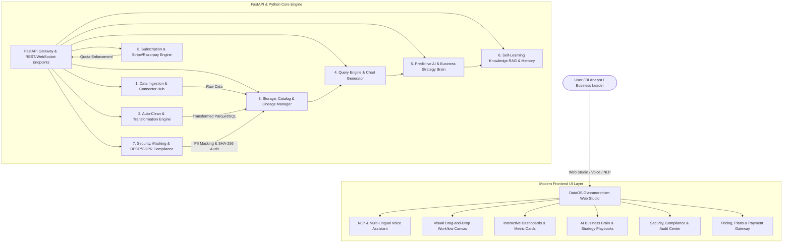

# 🌐 Intelligent End-to-End Big Data & Analytics Platform (DataOS)
### *A Universal, No-Code, AI-Powered Autonomous Data Operating System*

---

## 🌟 Executive Overview
**DataOS** is a comprehensive, production-grade Data Operating System designed as a complete Final Year Engineering Capstone Project. It eliminates tool fragmentation by consolidating the entire lifecycle of data — acquisition, automated cleaning (ETL), visual pipeline orchestration, conversational natural language querying (NLQ), predictive AI analytics, regulatory security compliance (DPDP 2023 / GDPR), and subscription monetization — into a single unified platform.

---

## 🏛️ System Architecture



---

## 🚀 Key Modules & Capabilities

### 1. 📥 Multi-Source Data Acquisition & Ingestion
- Ingests **CSV, TSV, JSON, Parquet, and Excel** files seamlessly.
- Connects to external **REST APIs and Webhooks**.
- Simulates real-time **IoT telemetry sensor streams** over WebSockets.
- Pre-loaded with realistic Indian GST financial invoices, global e-commerce sales, and customer churn retention records.

### 2. ⚡ Auto-ETL & Visual Workflow Builder
- **1-Click Auto-Clean:** Statistical missing-value imputation (median/mode), IQR outlier capping, date normalization, and deduplication.
- **Data Quality Scorecard:** Quantitative 0-100% fidelity scoring before and after transformations.
- **Visual DAG Studio:** Drag-and-drop workflow canvas with nodes (`Source`, `Filter`, `Select`, `Aggregate`, `Mutate`, `Auto-Clean`, `PII Redact`) and step-by-step diff inspection.
- **Data Lineage:** Tracks complete parent-child dataset evolution and snapshot commit history.

### 3. 💬 Conversational NLQ & Multi-Lingual Voice Assistant
- Converts natural language queries into automated SQL and analytics.
- **Web Speech API Voice Input** supporting English (US/India), Hindi, Spanish, French.
- **Speech Synthesis (TTS)** reads back key statistical findings.
- **Self-Learning Query Memory:** Automatically caches recurring analytical queries with semantic matching.

### 4. 📊 Autonomous Dashboards & Executive Reporting
- Heuristic AI visualizer automatically maps data types to optimal charts (Time-series lines, multi-bars, donut shares, correlation heatmaps).
- Executive KPI cards with automatic trend badges.
- One-click export of structured **Executive Business Intelligence PDF/HTML Reports**.

### 5. 🧠 AI Business Brain & Autonomous Continual Learning
- **Continual Model Evolution:** The AI Brain continuously ingests, extracts features, and fine-tunes its predictive weights from every dataset uploaded or collected from live streams.
- **Autonomous Readiness Score:** Real-time tracking of the model's independence (0-100%) as loss decreases through gradient iterations.
- **📦 Independent Standalone Model Export:** Generate and download a completely self-contained Python model (`dataos_brain_standalone.py`) with zero external server dependencies, deployable directly into any external app, CLI, or microservice.
- **Time-Series Demand Forecasting:** Linear/polynomial trend regression with 95% confidence intervals.
- **Customer Retention & RFM Matrix:** Churn risk classification with revenue-at-risk calculations and automated retention levers.
- **Operational Anomaly Alerts:** Multi-sigma Z-score and Isolation Forest outlier detection.
- **Strategic Action Playbooks:** Domain-grounded recommendations for Indian GST compliance, RBI prudential ratios, SEBI governance, and e-commerce pricing elasticity.

### 6. 🛡️ Enterprise Security, DPDP Act 2023 & Cryptographic Audit
- **Sensitive PII Scanner & Redactor:** Regex detection and masking for Aadhaar, Indian PAN, Credit Cards, Emails, Phone numbers, and SSNs.
- **Statutory Compliance Scorecard:** Audited against Indian DPDP Act 2023, GDPR, and RBI Data Localization norms.
- **SHA-256 Chained Audit Ledger:** Immutable, cryptographically verified audit log recording all queries, mutations, logins, and exports.

### 7. 💳 Monetization, Subscriptions & Payment Gateway
- Tiered subscription architecture (**Community Starter Free**, **Pro Data Strategist**, **Enterprise Autonomous Brain**).
- Integrated **Razorpay & Stripe** checkout simulation with UPI and credit card support.
- Automated generation of GST-compliant Tax Invoices.

---

## 🛠️ Quick Start & Running the Platform

### Option A: Local Python Execution
```bash
# 1. Navigate to project directory
cd intelligent-data-os

# 2. Run the automated launcher
python run_platform.py
```
*Open your browser and navigate to:* `http://localhost:8000`

### Option B: Windows 1-Click Launch
Double-click `start.bat` in the project folder.

### Option C: Docker & Docker-Compose
```bash
docker-compose up --build
```

---

## 🧪 Running Automated Unit & Integration Tests
```bash
python -m unittest discover tests
```

---

## 🎓 Final Year Project Viva Preparation Guide

### 1. Problem Statement
Traditional analytics tools (Tableau, PowerBI, Alteryx, Databricks) are isolated, expensive, require steep technical learning curves, and lack native Indian compliance and self-learning capabilities. **DataOS** solves this by unifying the entire data lifecycle into a single, no-code, autonomous platform.

### 2. Core Novelty & Differentiators
1. **Self-Learning Semantic Memory:** Retains query knowledge and improves speed with every interaction.
2. **Indian Statutory Context:** Native checks for Indian DPDP Act 2023, GST reconciliation rules, and RBI data localization.
3. **Cryptographic Accountability:** Tamper-evident SHA-256 chained audit logs.
4. **End-to-End Monetization:** Complete billing ledger with Razorpay/Stripe checkout and invoice generation.

---

## 📄 License & Attribution
Developed for Final Year Project Capstone. Built with FastAPI, Pandas, Scikit-Learn, Chart.js, Tailwind CSS, and Lucide.
